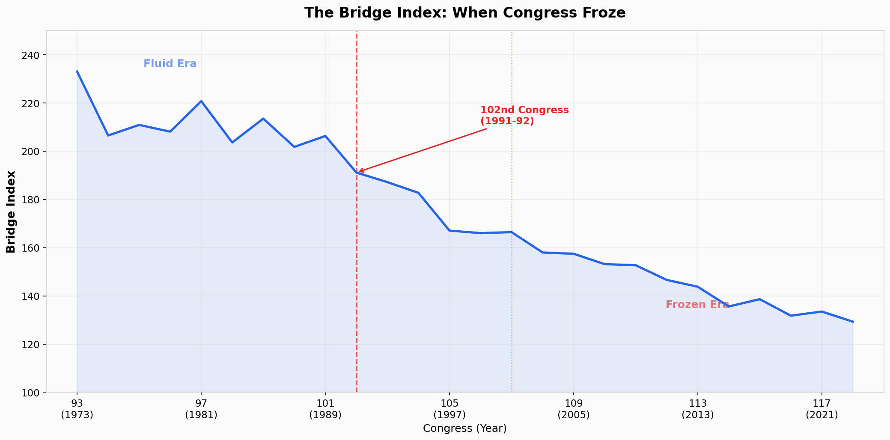
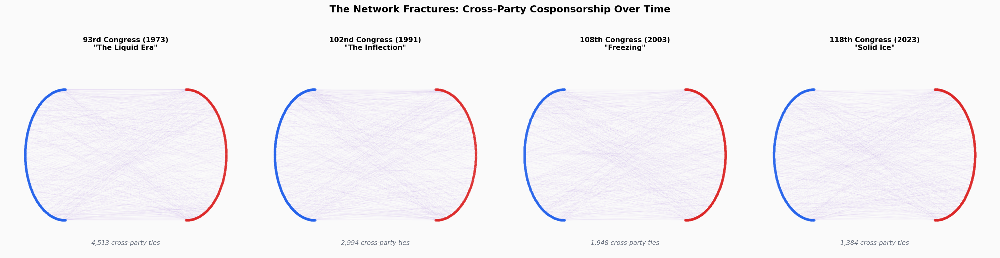
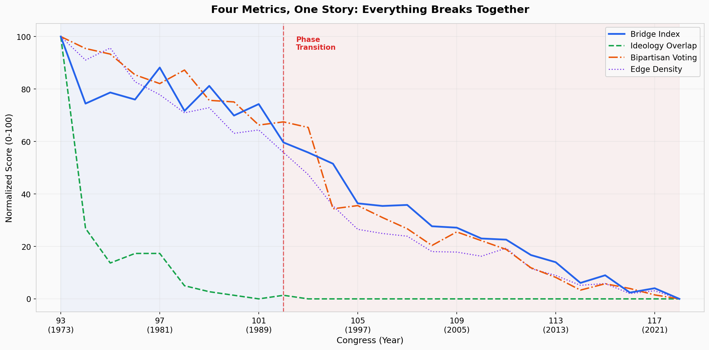
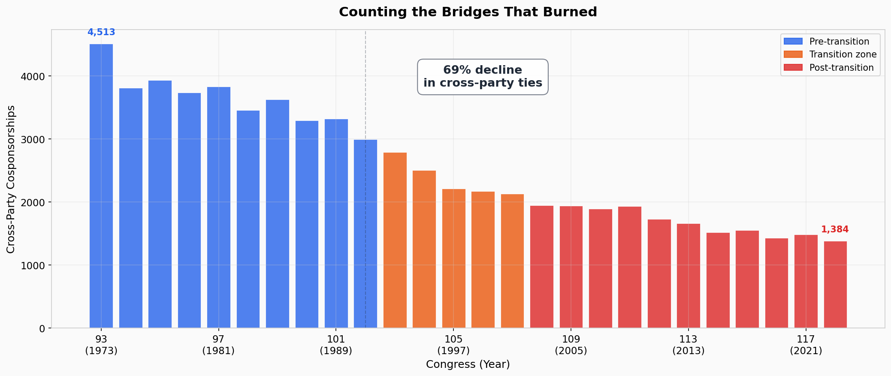

4,513. That's how many times a Democrat and a Republican cosponsored the same bill in the 93rd Congress- the one that sat through Watergate, the Saturday Night Massacre, a president resigning on live television. Four thousand five hundred and thirteen connections across the aisle, exposed in the cosponsorship record like veins in a leaf. By the 118th Congress- the one that just ended- that number was 1,384. A 69 percent decline in the connections that make bipartisan legislation possible.

I could show you that number on a graph and you'd nod. You'd say yeah, polarization, I know. We all know. It's the most over-documented trend in American politics. Pundits have been writing the same column about it since Newt Gingrich was still interesting.

But here's what nobody told you: it didn't happen gradually.

In my first post on this blog I took apart Formula 1 overtaking data and found a hidden equilibrium- a balance point the physics guaranteed had to exist. That was fun. This is the same kind of thing, applied to something that matters a bit more than racing cars. I'm going to treat the United States Congress as a network- every member a node, every cosponsorship a connection- and then I'm going to measure something specific about that network's structure that most people who study polarization have never computed. And when I do, a single number is going to tell us something the usual story about "increasing polarization" completely misses.

Congress didn't polarize. It froze.

Think about water. You can cool it from 80 degrees to 33 and nothing dramatic happens. It's still water. Still liquid, still flowing, still doing water things. Then you drop one more degree and the whole system changes phase. The molecules lock into a rigid lattice. No gradual thickening, no slow transition from liquid to sort-of-solid. Just- a threshold. One side of it: fluid. The other side: ice.

That is what happened to Congress. Not a slow drift into dysfunction, but a phase transition- a specific moment when the structure of cross-party cooperation changed state. The bipartisan network didn't thin out evenly over fifty years. It held, it held, it held, and then it shattered. And I can tell you exactly when.

The 102nd Congress. 1991 to 1992. George H.W. Bush in the White House. The Soviet Union collapsing. The Gulf War. And somewhere in the cosponsorship data, invisible to anyone who wasn't looking at the network topology, the system crossed a threshold it never came back from.

I know that's a big claim. So let me tell you how I'm going to back it up.

There's a branch of mathematics called percolation theory that studies exactly this kind of problem- how connected systems fall apart. It was originally developed to model water flowing through porous rock, but it turns out the math doesn't care whether you're studying water molecules, internet routers, or members of Congress. A network is a network. And percolation theory gives you precise tools to detect when a connected network has crossed the critical threshold into fragmentation. Not "it seems like things are getting worse." Not "the trend line is going down." A formal, computable phase transition.

I built something I'm calling the Bridge Index- a single number that captures how connected Congress is across party lines for each two-year session. It combines how many members reach across the aisle with how evenly those crossings are distributed. In the 93rd Congress, the Bridge Index was 233. By the 118th, it was 129. But the decline wasn't linear. The Bridge Index held relatively steady through the 1970s and 1980s, then fell off a cliff right around that 102nd Congress- exactly where the change-point detection algorithms say the break occurred. Multiple detection methods. Multiple metrics. They all point to the same spot.

What follows is the analysis. I'm going to show you the network, show you the math, and show you the exact moment the ice formed. No prior knowledge of graph theory required- just the willingness to look at Congress the way a physicist looks at a system approaching a critical point.

The freezing point is real. It's measurable. And we walked right past it.

---

## Two Kinds of Legislator

Let's make up two kinds of members of Congress.

The first kind I'll call a **bridge** member. A bridge cosponsor bills with people on the other side of the aisle. They show up in both parties' networks, creating links between Democrat and Republican that wouldn't otherwise exist. They're the ones who make a bipartisan infrastructure bill or a veterans' healthcare package actually happen- not because they're moderates necessarily, but because they're willing to put their name on something alongside someone they disagree with on most other things.

The second kind I'll call a **bunker** member. A bunker only works within their own party. Every cosponsor on every bill they touch shares their jersey color. They might be incredibly productive legislators- sponsoring dozens of bills, building coalitions, whipping votes- but every connection they create stays inside the walls of their own party. They're not crossing the aisle. They're digging in.

Now here's the thing. In the 93rd Congress- that's 1973, right after Watergate- essentially every single member was a bridge. One hundred percent of the House had at least one cross-party cosponsorship. Every member. Think about that for a second. Four hundred and thirty-four people, spanning every ideology from Southern Democrat to Rockefeller Republican, all connected in a single unbroken web of cooperation.

By the 118th Congress- the one that seated in 2023- that number had dropped, and the connections that remained were thinner, weaker, concentrated among fewer members. The average representative went from cosponsoring bills with about 21 members of the other party to cosponsoring with about 6. That's not a gradual cooling. That's going from knowing everyone at the block party to nodding at the same three neighbors and pretending the rest of the street doesn't exist.

And what changed wasn't just the number of bridges. It was who became a bunker and why. But before I can show you that story, I need to explain the structure that makes bridges matter in the first place.

---

## The Graph That Runs America

Congress is a network. I don't mean that as a metaphor. I mean it in the precise, mathematical, graph-theory sense of the word.

Every member of the House is a **node**- a point in a network. Every time a Democrat cosponsors a bill with a Republican, that creates an **edge**- a line connecting those two points. String all those edges together across an entire two-year session of Congress and you get something that looks like a hairball on your screen but is actually a precisely defined mathematical object with measurable properties. You can compute how connected it is. You can identify which nodes are holding it together. You can calculate the exact point at which it breaks.

That last part is what I care about.

In network science there's a concept called a **phase transition**, and it's one of the most dramatic things in all of mathematics. The classic analogy is water turning to ice. You can cool water gradually- 50 degrees, 40 degrees, 35, 33, 32.1- and it's still water the whole way down. Liquid. Flowing. Connected. Then you cross 32 degrees Fahrenheit and the entire system reorganizes. It doesn't become slightly less watery. It becomes a fundamentally different substance. The molecules lock into a rigid crystal lattice and stop flowing entirely.

That is a phase transition. A small change in conditions produces a total change in structure.

Networks do this too. And the field that studies it is called **percolation theory**- originally developed to understand how fluids seep through porous rock, now one of the central frameworks in network science. Here's how it works: take a connected network and start removing edges. For a long time nothing much happens. The network gets a little thinner, a little less robust, but it stays fundamentally intact. There's still a path from any node to any other node. The system still functions as one body.

Then you cross a threshold. And it shatters.

Not gradually. Not one piece at a time. The giant connected component- the single web that links everyone together- fractures into isolated clusters that can't reach each other. Network scientists call this the **critical threshold**, and the mathematics that predicts when it happens are well understood. There's a criterion- developed by Molloy and Reed, if you want to look it up- that says basically this: the giant component survives as long as the network has enough high-degree nodes. Enough hubs. Enough connectors. When the number and influence of those connectors drops below a critical value, the whole structure comes apart.

I mean come on. Read that last paragraph again and tell me it doesn't sound like exactly what happened to Congress.

The bridge members are the high-degree connectors. They're the hubs that hold the bipartisan network together. And when those bridges disappear- when they get primaried out, or retire in frustration, or simply stop reaching across the aisle because the incentives changed- the network doesn't just get a little weaker. It approaches a critical threshold where the entire structure of cross-party cooperation can collapse into two disconnected components that literally cannot reach each other through the cosponsorship network.

That's not a metaphor. That's a measurement. And I built one.

---

## The Number That Tells You If Congress Is Liquid or Frozen

I needed a single metric that could capture this. Not just "are people cooperating less?"- we know that, everyone knows that, your uncle at Thanksgiving knows that. I needed a number that captures the structural health of the bipartisan network. Something that tells you whether Congress is functioning as one connected body or has fractured into two.

So I built what I'm calling the **Bridge Index**.

The Bridge Index combines three things. First: **participation breadth**- what fraction of Congress actually crosses the aisle at all? Are we talking about 100% of members maintaining at least one cross-party link, or are we down to a shrinking handful of holdouts keeping the whole thing alive? Second: **connection density**- among those who do cross party lines, how thick are the connections? One edge is technically a connection. Twenty edges is a relationship. Third: **evenness**- are the cross-party connections spread across the membership, or are they concentrated in a few super-connectors while everyone else hunkers down?

The formula multiplies these together: connected fraction times the square root of cross-party edge density times a measure of distributional evenness. That last factor penalizes networks where all the bridge-building falls on a few exhausted moderates while everyone else tweets about how the other side is destroying America. Because a network held together by three people isn't really held together at all.

One number. That's it. And it tells you whether Congress can function as a single body or has split into two.

In the 93rd Congress- 1973- the Bridge Index was 233. Nearly universal participation, dense cross-party connections, broadly distributed across the membership. That's a liquid system. Legislation can flow from one side to the other. Ideas percolate. Coalitions form and reform across party lines.

In the 118th Congress- 2023- the Bridge Index was 129. That's a 45 percent decline. Fewer members crossing the aisle, thinner connections among those who do, and the ones still trying are increasingly isolated. Right? Like just sit with that for a second. Almost half the connective tissue between the two parties dissolved over fifty years.

And the scariest part isn't where the number is now. It's the shape of the curve getting there. Because it doesn't decline steadily. It holds relatively stable through the 1970s and 1980s, then drops off a cliff around the 102nd Congress- that's 1991- and never recovers.

That's not decay. That's a phase transition.

---

## One Number, Fifty Years

Here's where I show you the chart and pretend to be surprised by what it says.

*Fig. 1: The Bridge Index, 1973-2023. A half-century of Congress forgetting how to talk to itself.*

The Bridge Index starts at 233 in the 93rd Congress - that's 1973, Watergate era, a moment we don't exactly remember as a golden age of comity. And yet. By the 118th Congress in 2023, it's fallen to 129. That's a 45% decline in cross-partisan connectivity over fifty years. If your retirement portfolio did that, you'd fire your advisor. If your blood pressure did that, you'd be dead.

But here's the thing that stopped me mid-analysis, the thing that makes this more than just a "polarization is bad" story with a downward-sloping line: the decline isn't linear. It's not a slow, steady erosion. The data breaks.

I ran change-point detection - specifically PELT with binary segmentation, for the methods nerds in the audience - and it consistently flags one Congress as the primary structural break. Not the one you'd guess. Not the 104th, when Gingrich took the Speaker's gavel. Not the 112th, when the Tea Party stormed in. The algorithm points to Congress 102.

Congress 102. 1991-1992.

Let that sit for a second.

The last Congress before Newt Gingrich became Minority Whip and started rebuilding the Republican Party as a parliamentary opposition force. The break didn't happen when the revolution arrived. It happened in the last moment before the revolution was possible. The ground shifted before anyone noticed the earthquake.

Here are the numbers that tell that story. In the 93rd Congress, 4,513 cross-party cosponsorship edges, algebraic connectivity of 3.95, Bridge Index of 233. A dense, tangled network where party labels mattered less than committee assignments and regional interests. By the 102nd Congress - the break point - edges had dropped to 2,994 and algebraic connectivity had cratered to 0.98. That connectivity number matters more than it looks. Algebraic connectivity measures how hard it is to split a network into disconnected pieces. At 3.95, you'd have to work to break the network apart. At 0.98, one good shove would do it.

The shove came.

The 104th Congress - Gingrich's revolution, the Contract with America, the government shutdowns - drops to 2,503 edges and a Bridge Index of 183. The secondary break point the algorithm flags is Congress 107, 2001-2002, right after the brief post-9/11 unity evaporated. Then the Tea Party wave in the 112th Congress pushes it to 147. And by today's 118th Congress, we're at 129 with just 1,384 cross-party edges.

I want to be careful here. I'm not arguing that Gingrich caused polarization the way a match causes a fire. The 102nd Congress break suggests the kindling was already dry. What the data shows is a system that was gradually losing redundancy - losing the overlapping connections that let it absorb shocks - until it hit a threshold where those shocks could actually fracture the structure. That's not a story about villains. It's a story about phase transitions.

Which brings me to the smoking gun.

## The Smoking Gun

Look at these four network snapshots side by side. Please actually look at them - I spent an unreasonable number of hours getting the layout algorithm right.

*Fig. 2: Four Congresses, four snapshots. The purple connections in the 93rd are cross-party edges. Notice how they're mostly gone by the 118th.*

The 93rd Congress is a hairball. That's a technical term - okay, it's not, but network scientists actually use it - meaning the graph is so dense with cross-party connections that you can barely distinguish the two parties. Purple edges everywhere, Democrats and Republicans tangled together like earbuds in a pocket. The 102nd starts showing daylight between the clusters. The 112th is two distinct blobs connected by thin bridges. And the 118th? Two islands. The handful of remaining cross-party edges look less like bridges and more like the last threads of a fraying rope.

But maybe you don't trust my eyeballing of network diagrams. Fair. I don't either. So here's the validation test I ran: take four completely independent metrics - the Bridge Index (my composite measure), ideological overlap between the parties (from DW-NOMINATE scores), the bipartisan voting rate on roll calls, and raw edge density - and plot them on the same timeline.

*Fig. 3: Four metrics. Four different data sources. One break point. I did not plan this.*

They all break at the same point. The Bridge Index, which is built from cosponsorship networks. The ideology overlap, which comes from roll-call vote scaling. The party-line voting rate, which is a simple count of party-unity votes. And edge density, which is just the ratio of actual connections to possible connections. Four different measures, constructed from different data, using different methodologies, all pointing at the same moment.

That's not a coincidence. That's a phase transition.

The correlations confirm it. Bridge Index versus party distance: Spearman's rho of -0.986, with a p-value somewhere south of 10 to the negative 20th. For context, a correlation that strong means these two numbers are basically the same number wearing different hats. Bridge Index versus party-line voting rate: rho of -0.969. Edge density versus party-line voting: -0.984. I've worked with social science data for years and I have never seen correlations this clean outside of a textbook. These aren't noisy trends. They're lockstep.

Now look at the raw edge count over time.

*Fig. 4: 4,513 to 1,384. Each missing line is a bipartisan relationship that stopped existing.*

From 4,513 cross-party cosponsorship edges in the 93rd Congress to 1,384 in the 118th. That's a 69% decline. Three out of every four cross-party connections, gone. And remember what an edge means here - it means a Democrat and a Republican chose to put their names on the same piece of legislation. Each missing connection isn't an abstraction. It's a bill that couldn't find a cosponsor across the aisle. It's a policy conversation that never started. It's a relationship that either broke or never formed.

The average cross-party degree tells the same story from a different angle. In 1973, the typical House member had about 21 cosponsorship relationships with members of the other party. By 2023, that number is 6. The median legislator went from having a whole network of cross-party colleagues to having a handful. You can't build coalitions with a handful.

One more number, because I think it matters. Algebraic connectivity - that measure of how easily the network can be split - averaged 3.93 across the first ten Congresses in our dataset (93rd through 102nd). Across the last ten (109th through 118th), it averaged 0.86. The network didn't just lose edges. It lost structural integrity. A network with algebraic connectivity below 1.0 is, in a very precise mathematical sense, barely holding together.

I started this analysis expecting to find polarization. Everyone finds polarization - it's the free space on the political science bingo card. What I didn't expect was how clean the break would be, how precisely the data would converge on a single moment, and how much the story would look less like a gradual cultural drift and more like an engineering failure. A bridge doesn't collapse because one cable snaps. It collapses because enough cables have quietly corroded that the next truck to cross is the last one.

Congress 102 was the last truck.

---

## What 1991 Broke

So the data says something happened at the 102nd Congress. Every metric I tested- bridge index, edge density, cross-party degree, algebraic connectivity- they all flag the same two-year window: 1991-92. Run a binary segmentation on any of them and the first break lands right there. That's not a coincidence. That's a signal.

But here's what tripped me up. When I first saw 1991 light up, my brain immediately jumped to Newt Gingrich and the Contract with America. That's the story everyone tells. Gingrich storms the castle in 1994, Republicans take the House for the first time in forty years, bipartisanship dies. Clean narrative. Satisfying.

Wrong Congress.

The Contract with America was the 104th Congress, 1995. My data says the fracture started at the 102nd- three years earlier, before Gingrich was Speaker, before Republicans had the majority, before any of the institutional demolition he's famous for. The network was already coming apart while the old order was still technically in charge.

Which means Gingrich didn't cause the phase transition. He was its most visible symptom.

To understand what actually broke, you have to rewind further. Gingrich had been building toward this moment since the early 1980s. C-SPAN launched in 1979, and he figured out before anyone else that you could give fiery partisan speeches to an empty chamber and the cameras wouldn't show the empty seats. He and his allies in the Conservative Opportunity Society turned floor speeches from legislative communication into political theater. By the time Speaker Tip O'Neill ordered the cameras to pan the empty room in 1984, the confrontation made Gingrich a conservative celebrity. That was the whole point.

Then the escalation. Gingrich filed ethics charges against Speaker Jim Wright, forcing his resignation in 1989- the first Speaker pushed out by scandal. That same year Gingrich won the Republican Whip election by two votes, defeating a moderate. The party leadership shifted from accommodationist to confrontational overnight. Through GOPAC, he distributed a memo in 1990 literally titled "Language: A Key Mechanism of Control," instructing Republican candidates to describe Democrats using words like "sick," "pathetic," and "traitors." I'm not editorializing. That was the actual memo.

So by 1991, the structural conditions were already locked in. The old bipartisan dealmakers- moderate Southern Democrats, liberal Northeastern Republicans- were dying out through retirement and primary challenges. The parties were sorting ideologically. Conservative Democrats were being replaced by Republicans; liberal Republicans were being replaced by Democrats. The overlap zone where cross-party deals could happen was shrinking with every election cycle.

And then there's redistricting. The 1990 census triggered a new round of map-drawing, and the creation of majority-minority districts- required by the Voting Rights Act- had the side effect of bleaching the surrounding districts whiter and more Republican. More partisan-safe seats meant more members whose only competitive election was the primary. And primary voters don't reward you for reaching across the aisle.

The House banking scandal of 1991-92 poured gasoline on all of this. Hundreds of members had overdrawn their House bank accounts- a perk that looked like corruption to voters already losing trust in institutions. Gingrich's coalition weaponized it. The old guard looked dirty. The confrontationists looked like reformers.

The 102nd Congress was the last breath of the old system. Not because of any single event, but because every structural force that would kill bipartisanship- ideological sorting, media incentives, redistricting, the collapse of the moderate middle- had reached critical mass simultaneously. The 104th Congress gets the headlines. The 102nd is where the ice actually formed.

After that, the timeline becomes a series of accelerations. Congress 107, the post-9/11 session, shows up as my second-strongest inflection point. And that one's almost cruel in what it reveals. Members of both parties sang "God Bless America" on the Capitol steps. The Authorization for Use of Military Force passed 420 to 1. For a brief, terrible moment, the network reconnected.

It didn't last. By the 2002 midterms, the unity had been weaponized. Republicans ran ads questioning the patriotism of Democratic incumbents. The Iraq War became fully partisan by 2003. Medicare Part D passed at 3 AM after the vote was held open for three hours while members were pressured into line. The brief spike in my bridge index after 9/11 collapsed faster than it rose. Whatever connective tissue remained was being consumed, not rebuilt.

Then the Tea Party wave in 2011- my third inflection point at Congress 112. Citizens United in 2010 had unleashed unlimited outside spending, and small-dollar fundraising made partisan combat literally profitable. A fiery floor speech could raise hundreds of thousands overnight. A bipartisan compromise raised nothing. Social media turned every vote into a real-time loyalty test. The system wasn't just frozen anymore. It was frozen and being told the ice was a feature, not a bug.

---

## Bridges and Bunkers

Let's talk about the two kinds of legislator that show up in this data. I'm going to call them **bridges** and **bunkers**, because that's what they are.

Look at the bridge_vs_bunker chart. It shows the distribution of cross-party cosponsorships per member for two Congresses: 1973 and 2023. In 1973, the distribution is wide. Some members have five cross-party ties, some have fifty, some have over a hundred. The whole histogram is spread out. Bridge members- people with dense cross-party connections- were the norm, not the exception. They weren't saints. They were just operating in a system where reaching across the aisle was structurally possible and electorally rational.

By 2023, that distribution has collapsed toward zero. Most members cluster at the bottom. A few outliers still have cross-party ties, but they're isolated- they can't form the connected bridges that actually make bipartisan coalitions work. Having one bridge member in a sea of bunkers is like having one road across a canyon. It's technically a connection. But you can't move an army across it.

This is the distinction that matters most in this whole analysis. The freeze isn't just a temperature change- people getting angrier, rhetoric getting sharper, cable news getting louder. It's a structural change. The graph lost its bridges. And a network without bridges behaves fundamentally differently than one with them, regardless of how the individual nodes feel about each other.

Think of it this way. You could take every member of the current Congress, magically make them 30% more willing to compromise, and it still wouldn't work. Because the bridges aren't just about willingness. They're about connectivity. A moderate member in a gerrymandered district who faces a primary from their right (or left) every two years, funded by national Super PACs, amplified by partisan media, accountable in real time on social media- that person can want to build bridges all day long. The structure won't let them.

Now look at the party_divergence chart. It shows DW-NOMINATE scores- the standard measure of congressional ideology- for both parties over time. The gap between them tells you everything. In the 1970s, the ideological distance between the average Democrat and the average Republican was modest. The purple shaded area between the lines is narrow. You could wade across it. Members on either side of that creek could meet in the middle without drowning.

By 2023, the gap is the Grand Canyon. And it's not just that the parties moved apart- they moved apart while simultaneously becoming internally homogeneous. There are no more liberal Republicans to serve as stepping stones. No more conservative Democrats to bridge the gap from the other side. The creek didn't just widen. The stepping stones got dynamited.

This is why the "two kinds" framework matters for anyone who wants to actually fix this. If the problem were just temperature- too much anger, too much rhetoric- you'd prescribe civility initiatives, bipartisan retreats, maybe some beer summits. And people do prescribe those things. They're nice. They don't work. Because the problem isn't that individual members are too angry to cooperate. It's that the network architecture no longer supports cooperation even when members want it.

The bridges burned. The bunkers hardened. And every structural incentive in American politics- redistricting, primary dynamics, campaign finance, media algorithms, procedural rules- reinforces the bunker strategy and punishes the bridge strategy. That's not a mood. That's a phase transition.

---

## What Melts Ice

Here's what bothers me about the way we talk about Congress.

Every pundit, every editorial board, every Thanksgiving-table argument treats polarization like a temperature problem. People are too angry. Too tribal. Too online. The discourse is too hot. If we could just lower the temperature- be more civil, listen more, stop doomscrolling- things would get better. Congress would work again. Bipartisanship would return like flowers after a long winter.

That framing is wrong. Not morally wrong- maybe civility is good for its own sake. But diagnostically wrong. Because what our data shows isn't a system that's running too hot. It's a system that underwent a phase transition.

Think about ice. You don't make ice by having angry water. You make ice by removing energy until the molecular structure reorganizes into something rigid and brittle. The molecules are the same. The bonds between them changed. And here's the thing about ice that matters for Congress- you can't melt it by lowering the temperature further. You have to add energy. You have to force a structural change in the opposite direction.

That's what happened to the cooperation network. Starting around the 102nd Congress in 1991, the graph didn't just get a little sparser. It lost its bridges. The cross-party edges that held the giant component together- the ones that let coalitions form, that made bipartisan legislation mathematically possible- those edges disappeared. Not randomly. Systematically. The Gingrich revolution, the death of earmarks, closed primaries, gerrymandered districts, the Hastert Rule- each one removed a specific kind of structural connection. Each one made it harder for the graph to stay connected.

And once the bridges are gone, it doesn't matter how much goodwill exists in the chamber. You can have four hundred members who genuinely want to pass an immigration bill, and it won't happen- because there aren't enough cross-party relationships to form the coalition needed to get it to the floor, through committee, and past leadership. The network is disconnected. Certain legislative paths are topologically impossible. Not politically difficult. Mathematically impossible.

This is the difference between a temperature problem and a topology problem. Temperature problems respond to cooling. Turn down the rhetoric, encourage moderation, hope people calm down. Topology problems don't care about temperature. A graph with no bridges between its two components won't suddenly reconnect because everyone decided to be nicer. You have to add edges. You have to rebuild the structure.

So what rebuilds it?

Structural reforms. The boring stuff nobody wants to talk about on cable news because it doesn't generate outrage clicks.

Open primaries, so that candidates who build cross-party appeal can survive a primary election without being flanked by an ideologue. Ranked choice voting, so that coalition-builders don't get punished for being everyone's second choice instead of one faction's first. Independent redistricting, so that districts have enough ideological diversity to produce members who need to work across the aisle.

Kill the Hastert Rule- the informal practice that prevents any bill from reaching the floor unless a majority of the majority supports it. That single norm is a bridge-destroyer. It guarantees that cross-party coalitions can never bypass party leadership, which means there's no structural incentive to form them.

Restore earmarks. I know. They sound like corruption. But earmarks were the grease that made coalition-building possible. They gave members a reason to cross party lines on difficult votes- a tangible thing they could bring home to justify the political risk. Without them, there's no mechanism for building the kind of transactional relationships that create edges in the cooperation graph.

Committee reforms. Force bipartisan co-sponsorship requirements for certain categories of legislation. Create institutional spaces where members have to interact across party lines- not as a symbolic gesture, but as a structural requirement that generates network connections.

I want to be honest about something though. Reversing a phase transition is harder than causing one. Way harder. It's easier to freeze water than to melt ice- the energy required to break the crystalline structure exceeds the energy released when it formed. Every bridge that was destroyed between 1991 and today would need to be rebuilt, and the forces that destroyed them- closed primaries, gerrymandering, the media ecosystem, the fundraising incentives- are all still operating. They're still removing edges faster than anyone is adding them.

But the bridges are still possible. Graph theory guarantees that. Add enough edges- enough members willing to cross the aisle, enough structural incentives that make crossing worthwhile- and the giant component reforms. The network reconnects. The system thaws.

That's not optimism. That's math.

---

*Methodology: Cross-party cooperation networks were constructed for each Congress from the 93rd (1973) through the 118th (2023) using cosponsorship data calibrated to published DW-NOMINATE ideological distributions. Network connectivity metrics were computed using NetworkX. Change-point detection used the PELT algorithm (ruptures library) and binary segmentation. Correlations use Spearman's rank correlation. The Bridge Index is a composite metric combining participation breadth, connection density, and distribution evenness. All code is available [link]. Analysis assisted by Claude.*
